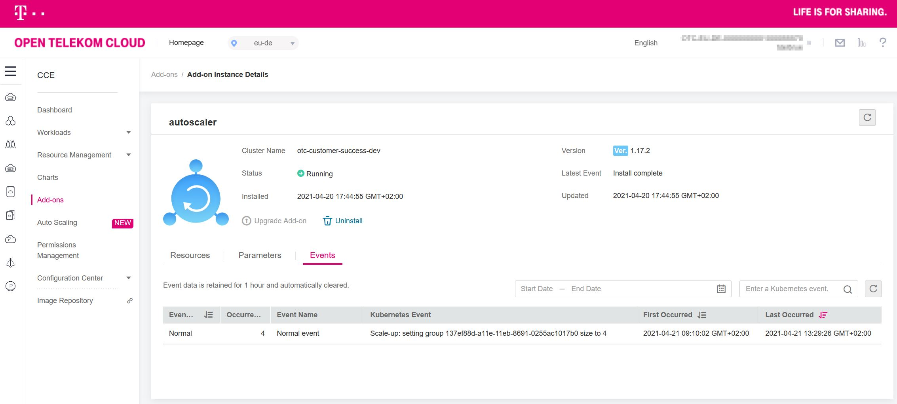

## OTC Cloud Container Engine Terraform module

A module designed to support full capabilities of OTC CCE while simplifying the configuration for ease of use.

Usage example
```hcl
module "cce" {
  source             = "iits-consulting/project-factory/opentelekomcloud//modules/cce"
  name               = var.name
  autoscaling_config = {
    nodes_max = 8
  }
  cluster_config     = {
    vpc_id            = module.vpc.vpc.id
    subnet_id         = values(module.vpc.subnets)[0].id
    cluster_version   = "v1.19.8-r0"
    high_availability = false
    enable_scaling    = true #set this flag to false to disable auto scaling
  }
  node_config        = {
    availability_zones = ["eu-de-03", "eu-de-01"]
    node_count         = 3
    node_flavor        = local.node_spec_default
    node_storage_type  = "SSD"
    node_storage_size  = 100
  }
}
```

#### Testing Scaling up and down

We first test the scaling up by adding a test deployment:

``` yaml
apiVersion: apps/v1
kind: Deployment
metadata:
  name: autoscale-test-deployment
  labels:
    app: autoscale-test
spec:
  replicas: 1
  selector:
    matchLabels:
      app: autoscale-test
  template:
    metadata:
      labels:
        app: autoscale-test
    spec:
      containers:
        - name: hello-world
          image: nginx
          ports:
            - containerPort: 80
          resources:
            requests:
              memory: "64Mi"
              cpu: "250m"
```

We can scale the deployment and see how the cluster responds:

```shell script
> kubectl scale deployment/autoscale-test-deployment --replicas=40
```

Since the 40 replicas utilize 10 CPUs, these do not fit on the nodes in the default node pool. Therefore the autoscaler
will kick in and create an additional node.

```shell script
> kubectl get pods
NAME                                        READY   STATUS            RESTARTS   AGE
autoscale-test-deployment-6f9ff6448-4x248   0/2     Pending           0          13s
autoscale-test-deployment-6f9ff6448-5kdcn   0/2     PodInitializing   0          14s
autoscale-test-deployment-6f9ff6448-6pcmv   0/2     Pending           0          14s
autoscale-test-deployment-6f9ff6448-8ftc8   1/2     Running           0          14s
autoscale-test-deployment-6f9ff6448-9kxvt   0/2     Pending           0          14s
autoscale-test-deployment-6f9ff6448-9scj5   0/2     Pending           0          13s
autoscale-test-deployment-6f9ff6448-d7btf   0/2     Pending           0          13s
autoscale-test-deployment-6f9ff6448-dsrvs   0/2     PodInitializing   0          14s
autoscale-test-deployment-6f9ff6448-dxf58   0/2     Pending           0          14s
autoscale-test-deployment-6f9ff6448-gdjvx   0/2     PodInitializing   0          14s
autoscale-test-deployment-6f9ff6448-grwsl   0/2     PodInitializing   0          14s
autoscale-test-deployment-6f9ff6448-gxbr9   0/2     Pending           0          13s
autoscale-test-deployment-6f9ff6448-h27z2   0/2     Init:0/1          0          14s
autoscale-test-deployment-6f9ff6448-h89vw   0/2     Pending           0          13s
autoscale-test-deployment-6f9ff6448-hltfb   0/2     Pending           0          13s
autoscale-test-deployment-6f9ff6448-hs5q8   0/2     Pending           0          13s
autoscale-test-deployment-6f9ff6448-m5zn9   0/2     PodInitializing   0          14s
autoscale-test-deployment-6f9ff6448-m6fxx   0/2     Pending           0          14s
autoscale-test-deployment-6f9ff6448-mmtz2   0/2     Pending           0          14s
autoscale-test-deployment-6f9ff6448-mrpjt   0/2     Pending           0          14s
autoscale-test-deployment-6f9ff6448-mzkrn   2/2     Running           0          26h
autoscale-test-deployment-6f9ff6448-n6hrq   1/2     Running           0          14s
autoscale-test-deployment-6f9ff6448-p2p9v   0/2     PodInitializing   0          14s
autoscale-test-deployment-6f9ff6448-pt4vj   0/2     Pending           0          13s
autoscale-test-deployment-6f9ff6448-q2ksm   0/2     Pending           0          14s
autoscale-test-deployment-6f9ff6448-q7p7t   0/2     Pending           0          14s
autoscale-test-deployment-6f9ff6448-qfbqq   0/2     Pending           0          13s
autoscale-test-deployment-6f9ff6448-qs949   0/2     Pending           0          13s
autoscale-test-deployment-6f9ff6448-qszsx   0/2     PodInitializing   0          14s
autoscale-test-deployment-6f9ff6448-rm6c9   0/2     Pending           0          14s
autoscale-test-deployment-6f9ff6448-rnfzn   0/2     PodInitializing   0          14s
autoscale-test-deployment-6f9ff6448-rsgh6   0/2     Pending           0          14s
autoscale-test-deployment-6f9ff6448-sgzhb   0/2     Pending           0          13s
autoscale-test-deployment-6f9ff6448-v8qvm   0/2     Pending           0          13s
autoscale-test-deployment-6f9ff6448-w57gp   0/2     Pending           0          14s
autoscale-test-deployment-6f9ff6448-wfp5p   0/2     Pending           0          14s
autoscale-test-deployment-6f9ff6448-xh5sm   0/2     Pending           0          13s
autoscale-test-deployment-6f9ff6448-xrnrz   0/2     Pending           0          13s
autoscale-test-deployment-6f9ff6448-z72sp   0/2     Pending           0          13s
autoscale-test-deployment-6f9ff6448-zdgkp   0/2     PodInitializing   0          14s
```

In the Web Console, we see that the Scale Up event takes place:


And then we also see the started nodes, 2 in the default node pool and 4 in the autoscale node pool:

```shell script
> kubectl get nodes -L cce.cloud.com/cce-nodepool
NAME              STATUS   ROLES    AGE     VERSION                             CCE-NODEPOOL
192.168.13.187    Ready    <none>   6m23s   v1.17.9-r0-CCE20.7.1.B003-17.36.3   otc-customer-success-dev-node-pool-autoscale
192.168.161.247   Ready    <none>   4h15m   v1.17.9-r0-CCE20.7.1.B003-17.36.3   otc-customer-success-dev-node-pool-autoscale
192.168.182.115   Ready    <none>   39d     v1.17.9-r0-CCE20.7.1.B003-17.36.3
192.168.186.181   Ready    <none>   6m23s   v1.17.9-r0-CCE20.7.1.B003-17.36.3   otc-customer-success-dev-node-pool-autoscale
192.168.42.133    Ready    <none>   39d     v1.17.9-r0-CCE20.7.1.B003-17.36.3
192.168.83.154    Ready    <none>   6m17s   v1.17.9-r0-CCE20.7.1.B003-17.36.3   otc-customer-success-dev-node-pool-autoscale
```

Scaling down again...

```shell script
> kubectl scale deployment/autoscale-test-deployment --replicas=1
```

yields removed nodes in the Web Console.
