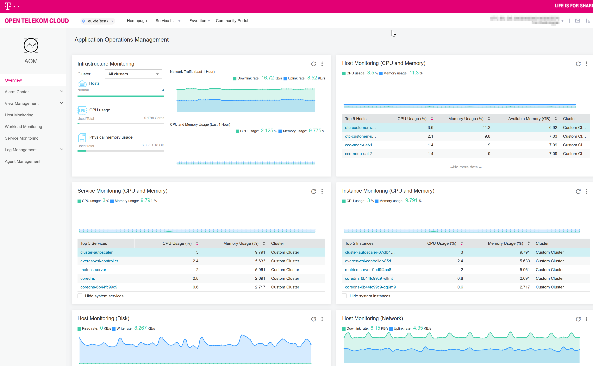

## How to use the cce_aom_ic_agent_installer module

   ```terraform
module "otc_aom_icagent_installer" {
  source          = "iits-consulting/project-factory/opentelekomcloud//modules/otc-monitoring"
  version         = "1.0.2"
  otc_project_id  = data.opentelekomcloud_identity_project_v3.otc_stage_project.id
  otc_tenant_name = "eu-de"
}

# Utilize it in your CCE nodes
resource "opentelekomcloud_cce_node_v3" "nodes" {
  for_each          = var.nodes
  cluster_id        = opentelekomcloud_cce_cluster_v3.cluster.id
  name              = "${var.node_name_prefix}-${var.stage_name}-${each.key}"
  availability_zone = var.availability_zone
  flavor_id         = each.value
  key_pair          = var.key_pair_id
  region            = var.region
  eip_count         = 0
  tags              = var.tags
  postinstall       = module.otc_aom_icagent_installer.node-postinstall-script
  data_volumes {
    size       = var.nodes_data_volume_size
    volumetype = var.nodes_data_volume_type
  }
  root_volume {
    size       = var.nodes_root_volume_size
    volumetype = var.nodes_root_volume_type
  }
  lifecycle {
    ignore_changes = [
      annotations
    ]
  }
  timeouts {
    create = "20m"
    delete = "20m"
  }
}

# Or in a CCE module
module "cce" {
  source  = "iits-consulting/project-factory/opentelekomcloud//modules/cce"
  version = "1.0.2"

  key_pair_id        = module.ssh_keypair.keypair_name
  stage_name         = var.stage_name
  subnet_id          = module.vpc.subnet_network_id
  vpc_flavor_id      = var.cce_vpc_flavor_id
  vpc_id             = module.vpc.vpc_id
  vpc_cidr           = var.vpc_cidr
  nodes              = local.node_specs
  tags               = var.tags
  context_name       = var.context_name
  postinstall-script = module.otc_aom_icagent_installer.node-postinstall-script
}

   ```

## [Deep Dive] How-To Use OTC Application Operations Management (AOM) with Terraform-built Kubernetes Cluster (CCE)

This assumes that you have created a CCE via Terraform and you have a shared TFState, for example via a OBS Bucket. We
recommend to put all the code from steps 1-3 inside a Terraform module. If you don't use a separate module for this, you
must change step 3 from an output variable to a local variable.

1. Create a special user with a random password in the project where the CCE is provisioned.
   ```terraform

    resource "random_password" "icagentinstallerpw" {
        length           = 16
        special          = true
        override_special = "_%@"
    }
    
    resource opentelekomcloud_identity_user_v3 icagentinstaller {
        name     = "icagentinstaller"
        password = random_password.icagentinstallerpw.result
    }
   ```
1. Create access keys for that user.
   ```terraform
    resource opentelekomcloud_identity_credential_v3 icagentinstaller_keys {
      user_id = opentelekomcloud_identity_user_v3.icagentinstaller.id
      status = "active"
      description = "Access and Secret Key of ICAgent Installer (installs ICAgent on Kubernetes Nodes)"
    }
   ```
1. Generate script that should be executed on kubernetes nodes after the normal installation.
   ```terraform
    output "node-postinstall-script" {
        depends_on = [opentelekomcloud_identity_credential_v3.icagentinstaller_keys, opentelekomcloud_identity_role_assignment_v3.icagentinstaller_apm_admin]
        value = "curl http://icagent-eu-de.obs.eu-de.otc.t-systems.com/ICAgent_linux/apm_agent_install.sh > apm_agent_install.sh && REGION=eu-de bash apm_agent_install.sh -ak ${opentelekomcloud_identity_credential_v3.icagentinstaller_keys.access} -sk ${opentelekomcloud_identity_credential_v3.icagentinstaller_keys.secret} -region eu-de -projectid ${var.otc_project_id} -obsdomain obs.eu-de.otc.t-systems.com -accessip 100.125.7.25;"
    }
   ```
1. Utilize script when initializing nodes of the kubernetes cluster.
   ```terraform
    resource "opentelekomcloud_cce_node_v3" "nodes" {
        for_each          = var.nodes
        cluster_id        = opentelekomcloud_cce_cluster_v3.cluster.id
        name              = "${var.node_name_prefix}-${var.stage_name}-${each.key}"
        
        # ...
        postinstall       = var.postinstall-script
        # ...
    }
   ```
1. Utilize it on separate node pools to support monitoring them, too.
   ```terraform
    resource "opentelekomcloud_cce_node_pool_v3" "node_pool_autoscale" {
        cluster_id         = var.cluster_id
        name               = "${var.cluster_name}-node-pool-autoscale"

        # ...        
        postinstall              = var.postinstall-script        
        # ...
    }
   ```
1. Recreate nodes and node pools
   ```shell
   terraform taint terraform taint module.cluster.opentelekomcloud_cce_node_v3.nodes[\"1\"]
   terraform taint terraform taint module.cluster.opentelekomcloud_cce_node_v3.nodes[\"2\"]
   terraform taint module.cluster_autoscaling.opentelekomcloud_cce_node_pool_v3.node_pool_autoscale
   terraform apply
   ```
1. Check functionality in Web Console
   
